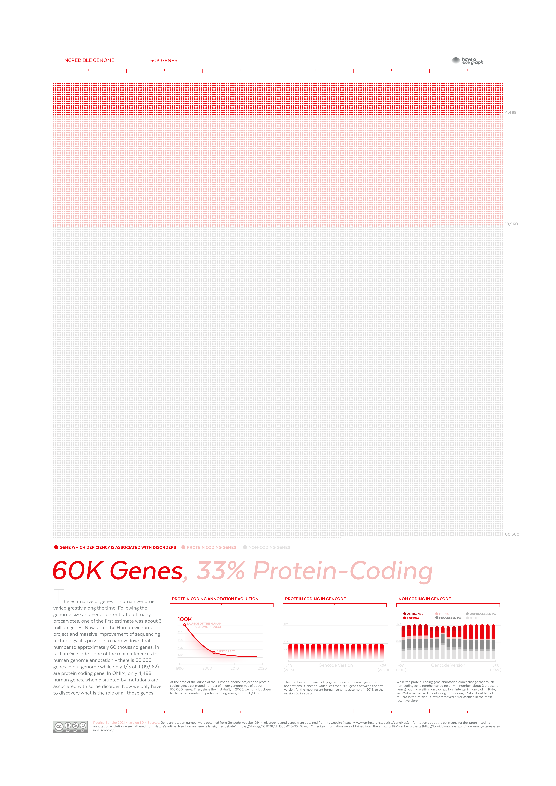

# Incredible Genome 🧬

Biological data, especially genetic information, is vast, intricate, and full of hidden stories waiting to be discovered. While genomes may seem mysterious and challenging to decode, the right visualization can transform complex data into clear, insightful, and even fun discoveries!

This project focuses on creating beautiful, intuitive plots that bring your genomic data to life. It highlights that clear visuals are not just aesthetically pleasing,they're crucial for truly understanding the rich, vibrant narratives embedded in our DNA.

Explore your genetic data through stunning visualizations that turn complexity into clarity, revealing how fascinating and visually striking our genomes can be!

## Posters

### 01 - DMD gene

### 02 - 60K genes

### 03 - Retrocopies

